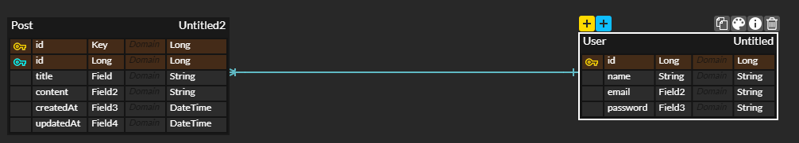

## wanted-pre-onboarding-backend

# 지원자 : 김태환

### API 요구사항

- [x] 로그인 서비스 #("/login")
    - [x] 로그인 기능
        - [x] 성공 시 JWT 토큰 로컬스토리지에 저장
- [x] 회원가입 컨트롤러 #("/signup")
    - [x] 회원가입 기능
        - [x] 성공 시 유저 정보 반환
- [x] 공통 기능
    - [x] 예외 처리
        - [x] 이메일 조건: `@` 포함
        - [x] 비밀번호 조건: 8자 이상
        - [x] 비밀번호 암호화 후 저장

- [x] 게시글 CRUD #post
    - [x] 게시글 추가
    - [x] 게시글 조회
        -[x] Pagination 기능 구현 - 10개 단위
    - [x] 게시글 수정
        -[x] 게시글 작성자만 가능
    - [x] 게시글 삭제
        -[x] 게시글 작성자만 가능

### 과제
게시판을 관리하는 RESTful API를 개발해 주세요. 이때, 다음의 기능을 구현해야 합니다. 데이터베이스의 테이블 설계는 지원자분의 판단에 맡겨져 있습니다. 요구사항을 충족시키는 데 필요하다고 생각되는 구조로 자유롭게 설계해 주세요.

- **과제 1. 사용자 회원가입 엔드포인트** [Post]("user/signup")
    - [x] 이메일과 비밀번호로 회원가입할 수 있는 엔드포인트를 구현해 주세요.
    - [x] 이메일과 비밀번호에 대한 유효성 검사를 구현해 주세요.
        - 이메일 조건: **@** 포함
        - 비밀번호 조건: 8자 이상
        - 비밀번호는 반드시 암호화하여 저장해 주세요.
        - 이메일과 비밀번호의 유효성 검사는 위의 조건만으로 진행해 주세요. 추가적인 유효성 검사 조건은 포함하지 마세요.
- **과제 2. 사용자 로그인 엔드포인트** [Post]("user/login")
    - [x] 사용자가 올바른 이메일과 비밀번호를 제공하면, 사용자 인증을 거친 후에 JWT(JSON Web Token)를 생성하여 사용자에게 반환하도록 해주세요.
    - [x] 과제 1과 마찬가지로 회원가입 엔드포인트에 이메일과 비밀번호의 유효성 검사기능을 구현해주세요.
- **과제 3. 새로운 게시글을 생성하는 엔드포인트** [Post]("post/create")
  - [x] 게시글 생성 엔드포인트 구현
- **과제 4. 게시글 목록을 조회하는 엔드포인트** [Get]("post/all")
    - [x] 반드시 Pagination 기능을 구현해 주세요.
- **과제 5. 특정 게시글을 조회하는 엔드포인트** [Get]("post/{id}")
    - [x] 게시글의 ID를 받아 해당 게시글을 조회하는 엔드포인트를 구현해 주세요.
- **과제 6. 특정 게시글을 수정하는 엔드포인트** [Put]("post/{id}")
    - [x] 게시글의 ID와 수정 내용을 받아 해당 게시글을 수정하는 엔드포인트를 구현해 주세요.
    - [x] 게시글을 수정할 수 있는 사용자는 게시글 작성자만이어야 합니다.
- **과제 7. 특정 게시글을 삭제하는 엔드포인트** [Delete]("post/{id}")
    - [x] 게시글의 ID를 받아 해당 게시글을 삭제하는 엔드포인트를 구현해 주세요.
    - [x] 게시글을 삭제할 수 있는 사용자는 게시글 작성자만이어야 합니다.
  
## 데이터베이스 테이블 구조

- 사용자 - 게시글 1-N 관계
- 한명의 사용자가 필수적으로 존재하며 사용자는 여러개의 게시글을 작성할 수 있다.
## API 명세(request/response 포함)
- ### userController
    - ####  ([POST] user/signup )
        - request Body(JSON)
            - {
              "username" : "사용자이름",
              "email" : "이메일 주소",
              "password" : "비밀번호",
              }
        - response 200 : 회원 가입 성공 하였습니다.
        - response 400 : {"message": "@ 이메일 형식이 올바르지 않습니다."}
        - {"message": "이미 존재하는 이메일입니다."}
    - #### ([POST] /user/login )
        - request Body(JSON)
            - {
              "email" : "이메일 주소",
              "password" : "비밀번호",
              }
        - response 200 : {
          "AccessToken : "JWTToken",
          "refreschToken : "refreshToken",
          }
        - response 400 : { "message": "패스워드는 최소 8글자 이상이어야 합니다."}
        - {"message": "이메일 형식이 올바르지 않습니다."}

- ### postController
    - #### ([GET] /post/all)
        - response 200 :
          {
          "communities": [
          {
          "communityId": 0,
          "communityName": "string",
          "createdDate": "2023-08-04T13:08:00.344Z",
          "userId": 1
          }
          ],
          "totalPages": 1
          }
    - #### ([GET] /post/{id})
        - request Path(Long)
        - response 200 :{"title": "게시글이름","content": "게시판내용","userName": "사용자이름","createDate": "등록날짜"}
    - #### ([POST] /post/create)
        - request Parm(Long)
        - request Body(JSON)
          {
          "communityName": "게시글 이름",
          "content": "게시글 내용"
          }
       
    - #### ([DELETE] /post/{id})
        - request Path (Long) (postId)
        - request Parm (Long) (userId)
    - #### ([PUT] /post/{id})
        - request Path (Long) (postId)
        - request Parm (Long) (userId)
        - request Body (JSON)
          -{"title": "string","content": "string"}
